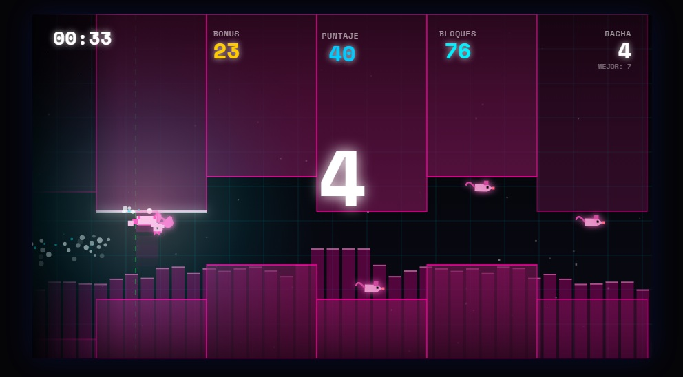

# 🌌 Gravity Runner

**Gravity Runner** es un adictivo juego de ritmo y plataformas desarrollado con **Vite**, **HTML5 Canvas** y **JavaScript puro**. Esquiva bloques mientras la música dicta el ritmo del juego. Experimenta transformaciones visuales progresivas a medida que aumentas tu racha.



## 🚀 Características Principales

- **Mecánica de Gravedad Única**: Presiona (ArrowDown / ArrowRight / S / D) para descender, suéltala para ascender. ¡La precisión es la clave!
- **Sistema de Audio Adaptativo**: Sube tus propios archivos MP3/WAV. El juego analiza automáticamente el perfil de beats para generar niveles sincronizados con la música.
- **8 Personajes Únicos con Transformaciones de Tier**:
  - **CUBE**: El clásico geométrico minimalista.
  - **CAT**: Un gato ágil con animaciones de carrera y cola animada.
  - **BEE**: Una abeja con alas animadas y cuerpo dinámico.
  - **DRONE**: Un núcleo mecánico flotante con alas rotatorias.
  - **GHOST**: Un espectro semi-transparente que flota suavemente.
  - **UFO**: Una nave espacial con luces reactivas.
  - **NINJA**: Un guerrero con movimientos de sombra elegante.
  - **SHARK**: Un depredador neón que surca el espacio.

  _Cada personaje se transforma visualmente a través de 4 tiers al aumentar tu racha (visualmente mejoran, ganan efectos, auras y transformaciones épicas)._

- **Sistema Progresivo de Racha (Streak Tiers)**:
  - **Tier 0-3**: Mejoras visuales básicas (flashes, colores)
  - **Tier 4**: ✦ POWERED UP (racha 100+) - Personaje transformado
  - **Tier 5**: ⚡ UNLEASHED (racha 125+) - Efectos avanzados
  - **Tier 6**: ★ ASCENDED (racha 150+) - Glow épico
  - **Tier 7**: ∞ GOD MODE (racha 175+) - Transformación final

- **Patrones de Bloques Inteligentes**:
  - **ESCALERA_UP/DOWN**: Sube o baja gradualmente
  - **ZIGZAG**: Alterna entre arriba y abajo
  - **MUSIC_RANDOM**: Sigue el análisis de beats de la música

- **Sistema de Monedas Dinámico**: 60% de probabilidad de generar monedas en cada bloque. Colecciónalas para acumular puntos bonus y mejorar tu puntuación total.

- **Estética Cyber-Neon**: Colores HSL dinámicos que cambian según el volumen, fondos con grillas retro, efectos de partículas y glows.
- **Persistencia Local**: Canciones y mejores puntuaciones se guardan automáticamente en `LocalStorage`.

## 🎮 Cómo Jugar

1. **Menú Principal**: Selecciona una canción guardada o crea una nueva subiendo un archivo de audio.
2. **Controles**:
   - **Presiona (ArrowDown / ArrowRight / S / D)**: El personaje desciende hacia el suelo.
   - **Suelta**: El personaje asciende hacia el techo.
   - **ESPACIO / P**: Pausa/Reanuda el juego.
   - **+**: Aumenta el volumen (+5%)
   - **-**: Disminuye el volumen (-5%)

3. **Objetivo**: Esquiva los bloques superiores e inferiores. Mantén una racha perfecta para:
   - Aumentar tu multiplicador de puntos
   - Desbloquear transformaciones progresivas del personaje
   - Alcanzar el legendario "GOD MODE" con racha de 175+

4. **Sistema de Puntuación y Multiplicador**:
   - Cada bloque esquivado = +1 en racha (streak)
   - El multiplicador aumenta dinámicamente: x1 (base) → x2 (50+) → x3 (100+) → x4 (150+) → x5 (200+)
   - La puntuación total = bloques esquivados × multiplicador
   - Monedas coleccionadas se suman a la puntuación total
   - Si golpeas un bloque, tu racha se reinicia a 0
   - Se rastrean: tiempo, racha actual, bloques totales esquivados, puntuación total, mejores puntos
   - Transformaciones visuales ocurren automáticamente al alcanzar ciertos hitos de racha

## 🛠️ Instalación y Ejecución

Este proyecto utiliza **Vite** como empaquetador. No requiere instalación externa compleja.

### Opción 1: Desarrollo Local (Recomendado)

```bash
# Clona el repositorio
git clone https://github.com/tu-usuario/runner-gravity.git
cd runner-gravity

# Instala dependencias
npm install

# Inicia servidor de desarrollo (abrirá automáticamente en el navegador)
npm run dev
```

### Opción 2: Compilar para Producción

```bash
# Construye la versión optimizada
npm run build

# Vista previa de la compilación
npm run preview
```

### Opción 3: Usar Directamente

Simplemente abre `index.html` en un navegador moderno (requiere soporte para ES6 modules y Web Audio API).

## � Tecnologías Utilizadas

- **Vite**: Build tool ultrarrápido y servidor de desarrollo
- **HTML5 Canvas**: Motor de renderizado 2D de alto rendimiento (900x500px)
- **Web Audio API**: Procesamiento de sonido en tiempo real, análisis de beats, control de volumen
- **Vanilla JavaScript**: Lógica de juego 100% pura, sin dependencias externas
- **CSS3**: Diseño responsivo con Glassmorphism y tipografía moderna (Space Mono)
- **LocalStorage**: Persistencia de canciones, personajes y puntuaciones locales

### Arquitectura de Módulos

- `main.js` - Loop principal y sincronización
- `audio.js` - Gestión de Web Audio API y análisis de beats
- `characters.js` - Sistemas de dibujo para 8 personajes + transformaciones tier
- `obstacles.js` - Generación procedural de bloques con patrones inteligentes
- `physics.js` - Lógica de movimiento, colisiones y puntuación
- `render.js` - Sistema de renderizado del canvas
- `ui.js` - Interfaz de menú, pausa y game over
- `storage.js` - Gestión de persistencia local
- `state.js` - Estado global centralizado del juego
- `constants.js` - Constantes y niveles

## 🎯 Características Técnicas Avanzadas

### Sistema de Análisis de Audio

- **Beat Detection**: Analiza el perfil de frecuencias en tiempo real
- **RMS Calculation**: Detecta los picos de energía (beats) automáticamente
- **Adaptive Difficulty**: Ajusta el tamaño de las brechas según la energía de la música
- **Hue Shift**: Los colores cambian dinámicamente según el volumen (rango 200-360° HSL)

### Génesis Procedural de Niveles

- **Análisis de Beats**: Genera bloques sincronizados con picos de energía
- **Patrones Variados**: ESCALERA_UP/DOWN crean ascensos suaves, ZIGZAG alternancia rápida
- **Countdown Blocks**: Los primeros 3.5 segundos son de preparación
- **Duración Dinámica**: Los niveles duran lo que la música

### Sistema de Partículas

- Estelas de movimiento del personaje
- Explosiones visuales al golpear bloques
- Efectos de particles al alcanzar tier-ups

### Rendimiento

- **60 FPS** en la mayoría de dispositivos
- Canvas optimizado con `clearRect` eficiente
- Uso mínimo de memoria con object pooling implícito

## 🎨 Personalización

### Agregar Nuevos Personajes

1. Define una función `draw[Character](cx, s, drawState, tier)` en [characters.js](src/characters.js)
2. Importa la función en [charPreview.js](src/charPreview.js)
3. Añade el personaje al array `CHARS` en [charPreview.js](src/charPreview.js)

### Ajustar Dificultad

Modifica en [constants.js](src/constants.js):

- `C.GAP` - Brecha entre bloques (distancia vertical segura)
- `STEP_Y` - Tamaño de escalones en patrones
- `LEVELS` - Altura de los bloques

### Cambiar Visuales

- `C.COL` - Paleta de colores
- Rango HSL dinámico para efectos de energía

## 📈 Sistema de Puntuación

El multiplicador aumenta dinámicamente según tu racha (streak):

| Racha   | Multiplicador | Tier Visual                                    |
| ------- | ------------- | ---------------------------------------------- |
| 0-9     | x1            | 0-1: Base (sin efectos)                        |
| 10-24   | x1            | 1: Tier I (brillo suave)                       |
| 25-49   | x1            | 2: Tier II (aura)                              |
| 50-99   | x2            | 3: Tier III (partículas)                       |
| 100-149 | x3            | 4: ✦ POWERED UP (Transformación del personaje) |
| 150-199 | x4            | 5: ⚡ UNLEASHED (Glow intenso)                 |
| 200+    | x5            | 6-7: ★ ASCENDED / ∞ GOD MODE                   |

**Cómo funciona**:

- Cada bloque esquivado suma +1 a tu racha (streak)
- La puntuación total = (bloques esquivados × multiplicador) + monedas coleccionadas
- Golpear un bloque reinicia la racha a 0
- El multiplicador y tier visual se muestran en tiempo real en el HUD

## 🤝 Contribuciones

Las contribuciones son bienvenidas. Puedes:

- Agregar nuevos personajes o transformaciones de tier
- Mejorar patrones de generación de bloques
- Optimizar rendimiento
- Añadir nuevos efectos visuales
- Traducir UI a más idiomas

## 📝 Licencia

Este proyecto es de código abierto bajo licencia MIT. ¡Siéntete libre de mejorarlo, remixarlo o crear versiones derivadas!

---

Desarrollado con ❤️ para amantes del ritmo, la velocidad y los desafíos sincronizados con música.

**Ver también**: [charPreview.js](src/charPreview.js) para el sistema de previsualizaciones de personajes, [physics.js](src/physics.js) para la mecánica de colisiones.
